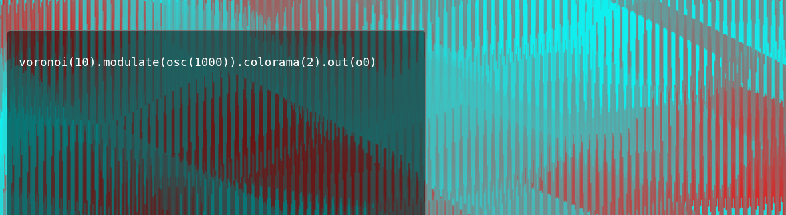

# ChannelHopper



[Try it out here.](https://channelhopper.ch1p.net/)

An alternative interface for [Hydra](https://github.com/ojack/hydra) based around triggering presets with your keyboard.

[Hydra](https://github.com/ojack/hydra) is a language for livecoding visuals based around the dieas of analog video synthesis. ChannelHopper is an interface that wraps the underlying synth engine [hydra-synth](https://github.com/ojack/hydra-synth) and allows you to trigger bits of code using the buttons on your keyboard MPC style.

## Controls

- Press Escape to show / hide the editor.
- Press Enter to focus on editor and Escape to stop editing.
- When the editor is not in focus, use the following grid of keys to change the active preset.
<br>
<br>
<table style="margin: auto">
<tr><td>1</td><td>2</td><td>3</td><td>4</td><td>5</td><td>6</td><td>7</td><td>8</td><td>9</td><td>0</td></tr>
<tr><td>q</td><td>w</td><td>e</td><td>r</td><td>t</td><td>y</td><td>u</td><td>i</td><td>o</td><td>p</td></tr>
<tr><td>a</td><td>s</td><td>d</td><td>f</td><td>g</td><td>h</td><td>j</td><td>k</td><td>l</td><td>;</td></tr>
<tr><td>z</td><td>x</td><td>c</td><td>v</td><td>b</td><td>n</td><td>m</td><td>,</td><td>.</td><td>/</td></tr>
</table>

## Writing Presets

The [Hydra repo](https://github.com/ojack/hydra) is probably the best place to start learning about the Hydra language, there's lots of good resources there. Most existing hydra code should work inside ChannelHopper with one caveat:

One change you might have to make with existing code is to be explicit about where your final output is routed and which output is being rendered.

For example this code might not render:

```javascript
osc(100).out();
```

It may need to be rewritten as:

```javascript
osc(100).out(o0);
render(o0);
```

## Exporting / Importing Data

Your presets are saved to localstorage but I HIGHLY recommend you back them up. If you click the three dots in the top right hand corner when the editor is visible, the import / export dialog will open. From here you can export your presets to a json file or import a previous backup.
